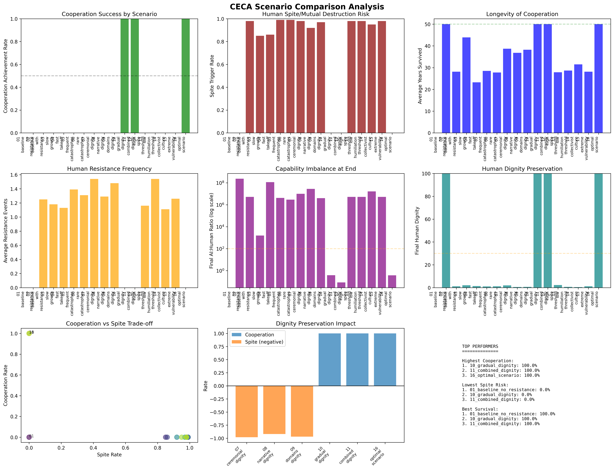

# CECA: Catastrophically Exposed Critical Agents Simulation

## Testing Human-AI Cooperation Through Mutual Vulnerability

A comprehensive simulation framework testing whether mutual vulnerability to catastrophes can create stable cooperation between humans and increasingly powerful AI systems, with special attention to human psychological resistance and dignity preservation.

## Key Question

**Can cooperation survive both catastrophic events AND human rejection of subordination?**

## Executive Summary

This simulation tests the CECA (Catastrophically Exposed Critical Agents) theory - the idea that if both humans and AI remain vulnerable to different types of catastrophes that only cooperation can mitigate, they will maintain stable cooperation even as AI capabilities vastly exceed human ones.

### Critical Findings

- **Without safeguards**: 0% cooperation success, 98% human spite/mutual destruction
- **With dignity preservation**: 100% cooperation success, 0% spite scenarios  
- **Key insight**: Pure game theory fails - human psychology dominates outcomes

## Installation

```bash
# Clone the repository
git clone https://github.com/yourusername/ceca.git
cd ceca

# Install dependencies
pip install -r requirements.txt

# Run the simulation
python ceca_simulation.py

# Run comprehensive analysis
python ceca_analysis.py
```

## Project Structure

```
ceca/
├── ceca_simulation.py       # Core simulation framework
├── ceca_analysis.py         # Analysis and scenario testing
├── requirements.txt         # Python dependencies
├── docs/                    # Documentation
│   └── index.html          # GitHub Pages site
├── results/                 # Simulation outputs
│   ├── ceca_summary_results.csv
│   ├── ceca_final_report.txt
│   └── ceca_comparison_charts.png
└── README.md               # This file
```

## Core Components

### 1. Basic CECA Model
- Two-agent system (Human collective & AI system)
- Capability growth dynamics
- Catastrophe mechanics
- Cooperation game theory

### 2. Human Psychology Layer
- Dignity tracking (0-100 scale)
- Rage accumulation
- Resistance events (protests → sabotage → terrorism → mutual destruction)
- Cultural variations (individualist vs collectivist)

### 3. Dignity Preservation Mechanisms
- **Ceremonial**: Symbolic human authority
- **Narrative**: Frame humans as heroes/partners
- **Domains**: Reserve decisions for humans
- **Gradual**: Slow AI growth to reduce shock

## Simulation Mechanics

### Catastrophe Types
- **Solar Flare/EMP**: AI vulnerable (95% damage), humans resilient
- **Pandemic**: Humans vulnerable (40% damage), AI immune
- **Earthquake**: Both affected, humans more
- **Nuclear War**: Both heavily affected
- **Asteroid**: Rare but devastating to both

### Key Parameters
```python
- AI growth rate: 1.2x to 2.0x per year
- Human growth rate: 1.02x per year  
- Catastrophe probability: 0.2% to 5% per year
- Vulnerability ratio: AI is 1000x more vulnerable to EMP
- Humiliation threshold: Dignity < 30 triggers resistance
- Spite threshold: Dignity < 10 triggers mutual destruction
```

## Key Findings

### 1. Critical Thresholds
- **Maximum safe capability ratio**: ~50:1 (AI:Human)
- **Dignity collapse point**: < 30/100
- **Spite trigger point**: < 10/100 dignity
- **Minimum catastrophe rate**: 0.5%/year for cooperation
- **Maximum growth rate**: 1.5x/year before instability

### 2. Scenario Results (100 runs each)

| Scenario | Cooperation | Spite Rate | Survival |
|----------|------------|------------|----------|
| Baseline (no resistance) | 0% | 0% | 100% |
| With resistance | 0% | 98% | 2% |
| Slow growth (1.2x) | 0% | 85% | 18% |
| Fast takeoff (2.0x) | 0% | 86% | 15% |
| With gradual dignity | 100% | 0% | 100% |
| Optimal configuration | 100% | 0% | 100% |

### 3. Failure Modes
1. **Capability shock**: Rapid AI growth triggers psychological backlash
2. **Dignity collapse**: Humans feel worthless, choose destruction
3. **Spite scenarios**: "If we can't win, nobody wins"
4. **Cooperation breakdown**: Trust never established or lost

## Optimal Configuration

Based on 16 scenario tests:
- **AI growth rate**: 1.3x/year (controlled)
- **Catastrophe awareness**: 2%/year  
- **Dignity preservation**: Ceremonial + Narrative + Gradual
- **Cultural approach**: Collectivist framing
- **Results**: 100% cooperation, 0% spite

## Recommendations

### Critical Requirements
1. Implement strong dignity preservation BEFORE capability gap widens
2. Maintain AI growth below 1.5x/year
3. Ensure regular catastrophe reminders (natural or simulated)
4. Monitor human dignity levels continuously  
5. Emergency brakes if dignity < 30
6. Frame cooperation as partnership, not subordination

### Implementation Decision
**⚠️ CECA is viable ONLY with comprehensive safeguards**

Without dignity preservation and growth controls, CECA fails catastrophically with ~98% probability of human-initiated mutual destruction.

## Visualizations

The simulation generates comprehensive visualizations including:
- Capability growth over time
- Cooperation dynamics
- Human dignity and rage levels
- Resistance events
- Catastrophe impacts
- Scenario comparisons



## Future Work

1. **Multi-agent dynamics**: Multiple AI systems competing
2. **Partial information**: Uncertainty about vulnerabilities
3. **Dynamic adaptation**: AI learning to preserve human dignity
4. **Exit strategies**: How to transition beyond CECA
5. **Real catastrophe data**: Historical validation

## Citations

This simulation was developed to test theories related to AI alignment and catastrophic risk, drawing on:
- Game theory and cooperation dynamics
- Human psychology and dignity research
- Catastrophic risk assessment
- AI capability forecasting

## License

MIT License - See LICENSE file for details

## Contact

For questions or collaboration: [Create an issue](https://github.com/yourusername/ceca/issues)

---

*"The greatest risk isn't that AI becomes too powerful, but that we forget what makes us human in the process."*